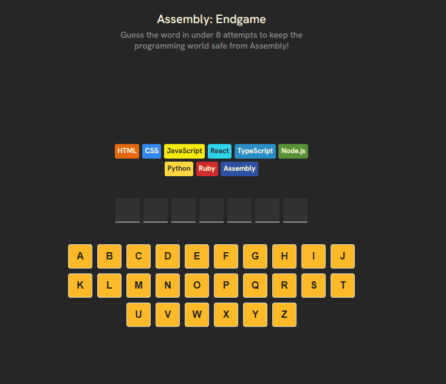
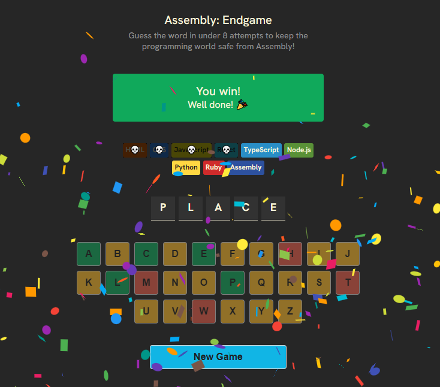
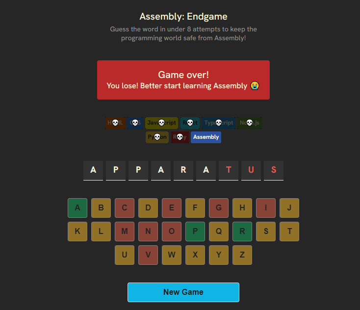

# 🎮 Assembly: Endgame  

Bienvenue dans le dépôt de **Assembly: Endgame**, un projet final du cours [Learn React for Beginners](https://scrimba.com/learn/learnreact) sur Scrimba. Ce jeu interactif et éducatif a été conçu pour mettre en pratique toutes les compétences React apprises au cours des chapitres précédents.  

## 📜 Description  

**Assembly: Endgame** est un jeu de devinettes basé sur des mots où l'objectif est de deviner le mot mystère en moins de 8 tentatives. Avec une interface soignée et des mécaniques bien pensées, ce projet couvre divers concepts de React tout en restant amusant et engageant.  

## 🚀 Fonctionnalités principales  

- **En-tête dynamique** : Présentation visuelle du titre et de l'objectif.  
- **Section de statut** : Indique si vous avez gagné ou perdu, ainsi que le langage de programmation qui est perdu à chaque faute.  
- **Liste des langues** : Découvrez un mot mystère.  
- **Affichage du mot** : Les lettres correctement devinées apparaissent.  
- **Clavier interactif** : Cliquez pour sur une lettre pour deviner, avec des styles visuels pour les lettres déjà essayées.  
- **Gestion des états de jeu** : Suivi des lettres devinées, des mauvaises tentatives et de l'état "gagné/perdu".  
- **Accessibilité améliorée (a11y)** : Améliorations pour une meilleure expérience utilisateur, y compris pour les personnes utilisant des technologies d'assistance.  
- **Nouvelle partie** : Un bouton pour réinitialiser le jeu avec nouveau un mot aléatoire.  

## 🛠️ Technologies utilisées  

- **React** : Pour construire l'interface utilisateur.  
- **CSS** : Pour une mise en page claire et esthétique.  
- **JavaScript** : Pour gérer la logique du jeu et l'interactivité.  

## 📦 Installation  

1. Clonez le dépôt :  
   ```bash  
   git clone https://github.com/KreeZeG123/assembly_endgame_react.git
   cd assembly_endgame_react
   ```  

2. Installez les dépendances :  
   ```bash  
   npm install  
   ```  

3. Lancez l'application :  
   ```bash  
   npm start  
   ```  

4. Ouvrez la page en localhost indiquée dans votre navigateur pour voir l'application.

## ✨ Aperçu







## 📄 Licence

Ce projet est sous licence MIT - voir la licence ci-dessous pour plus de détails.

```
MIT License

Copyright (c) 2025 MANFALOTI Yamis

Permission is hereby granted, free of charge, to any person obtaining a copy
of this software and associated documentation files (the "Software"), to deal
in the Software without restriction, including without limitation the rights
to use, copy, modify, merge, publish, distribute, sublicense, and/or sell
copies of the Software, and to permit persons to whom the Software is
furnished to do so, subject to the following conditions:

The above copyright notice and this permission notice shall be included in all
copies or substantial portions of the Software.

THE SOFTWARE IS PROVIDED "AS IS", WITHOUT WARRANTY OF ANY KIND, EXPRESS OR
IMPLIED, INCLUDING BUT NOT LIMITED TO THE WARRANTIES OF MERCHANTABILITY,
FITNESS FOR A PARTICULAR PURPOSE AND NONINFRINGEMENT. IN NO EVENT SHALL THE
AUTHORS OR COPYRIGHT HOLDERS BE LIABLE FOR ANY CLAIM, DAMAGES OR OTHER
LIABILITY, WHETHER IN AN ACTION OF CONTRACT, TORT OR OTHERWISE, ARISING FROM,
OUT OF OR IN CONNECTION WITH THE SOFTWARE OR THE USE OR OTHER DEALINGS IN THE
SOFTWARE.
```